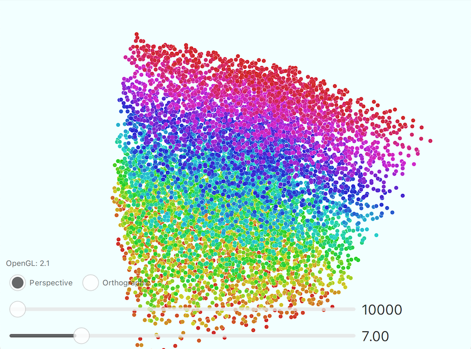

# PointSize_Qt5_GLSL
Qt 5.15.2のOpenGLを使って、ポイントサイズを変更するサンプルアプリ

## Demo

* マウスドラッグでキューブを回せます。
* スライダーでポイント数とサイズを変えられます。

## Features

Qt5のOpenGLのglPointSize()を使って変更しています。
動作確認はmacOS 13.2.1で確認しています。

## Requirement

* Qt Creator
* qmake
* Qt 5.15.2

## Note

* `/Library/Developer/CommandLineTools/SDKs/MacOSX13.1.sdk/System/Library/Frameworks/OpenGL.framework`

`xcode-select --install`でインストールしたSDKにはglPointSizeが定義されていました。

* `/Applications/Xcode.app/Contents/Developer/Platforms/MacOSX.platform/Developer/SDKs/MacOSX13.1.sdk/System/Library/Frameworks/OpenGL.framework`

XcodeのからインストールするSDKにはglPointSizeがありませんでした。
環境設定、OSによってビルドに失敗するかもしれません。

[WasdController.qml](WasdController.qml)はQt Quick 3Dの[ソースコード](https://github.com/qt/qtquick3d/blob/5.15/src/imports/helpers/WasdController.qml)を一部改変して使用しています。
